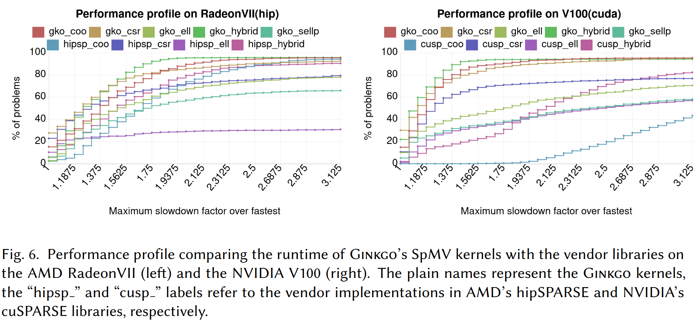

<!--watch-latex-md

This document is processed by watch_latex_md.py program, see

  https://github.com/Quansight/pearu-sandbox/latex_in_markdown/

You can edit this document as you wish. You can also edit the LaTeX
data in img elements, but only the content of `latex-data`:

  1. To automatically update the LaTeX rendering in img element, edit
     the file while watch_latex_md.py is running.

  2. Never change the beginning (``) parts of the LaTeX img elements as these are
     used by the watch_latex_md.py script.

  3. Changes to other parts of the LaTeX img elements will be
     overwritten.

Enjoy LaTeXing!

watch-latex-md:no-force-rerender
-->

# Literature

Since sparse tensor usage in deep learning is a new topic, in this document
we intend to collect various publications related to sparse tensor/matrix
computational techniques and how they can possibly be used in PyTorch.

## Papers

### Ginkgo: A Modern Linear Operator Algebra Framework for HighPerformance Computing

Link: https://arxiv.org/pdf/2006.16852.pdf

This paper describes the architecture of Ginkgo, a library implemented fast algorithms
for sparse linear algebra on GPUs. They show how C++ abstractions using runtime polymorphism
allow choosing between generic and hardware-specific algorithms that can be specially implemented
for various backends such as CUDA, HIP and openMP (see Fig. 1 in the paper for details).

Currently Ginkgo provides a list of Krylov solvers (BICG, BiCGSTAB, CG, CGS, FCG, GMRES) for
for iterative solutions of sparse matrices, along with various preconditioners.
The library has been designed from the ground up keeping in mind its usage within other frameworks
and libraries. Therefore it has a component based interface that allows combining various components
of say a solver and building one from the ground up (example in listing 3).

Ginkgo is licensed under the BSD-3 clause license.

Results reported between Gingko's SpMV and that from cuSPARSE and hipSPARSE show that Gingko
is faster in some cases. The tests are conducted on the matrices from SuiteSparse. It can be
seen that Gingko's algorithms cover most of the problems for a given slow down factor compared to
the fastest implementation for the given problem. The reporting of results does not convey the
actual speed of the kernels compared to HIP or CUSP but we do get an idea that Gingko is in 
general faster for most of the matrices in the problem set.

 

### Preparing Ginkgo for AMD GPUs –A Testimonial on Porting CUDA Code to HIP

Link: https://arxiv.org/pdf/2006.14290.pdf

TODO:
* https://arxiv.org/pdf/2006.16767.pdf
* https://ieeexplore.ieee.org/document/7092787
* https://ieeexplore.ieee.org/abstract/document/7965199?casa_token=jFN4uanr7p4AAAAA:jD4CKEczgvpg6bZ09NHFRSrQivmw8CzmP7ak2owWzr1nSqnGh1MIJYzl1OtMj-LOXVBljRDwIwzf
